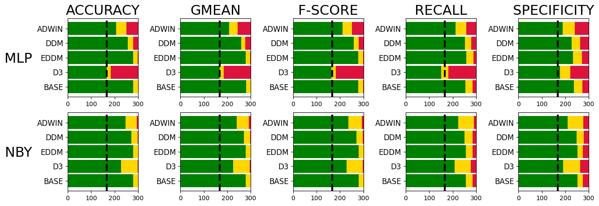
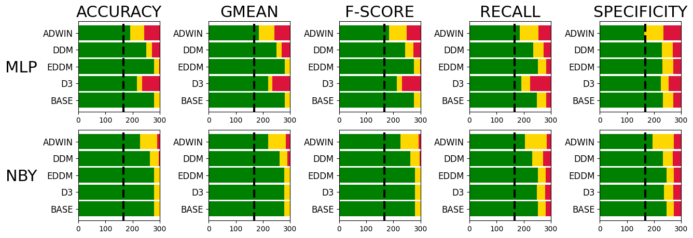
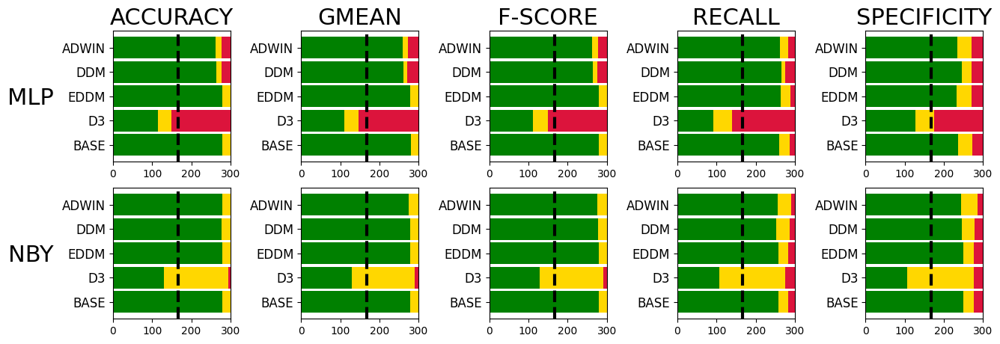
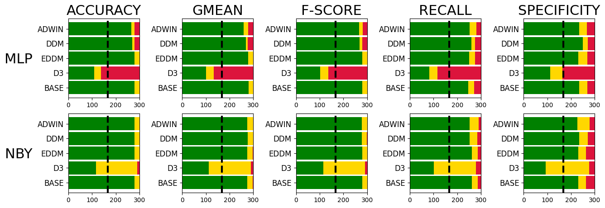
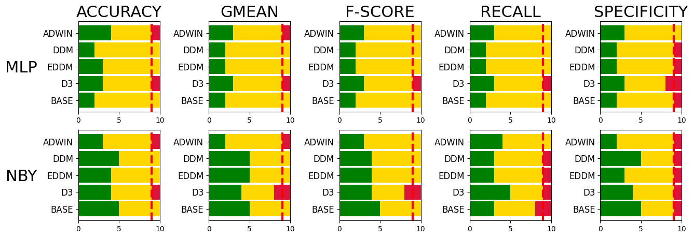
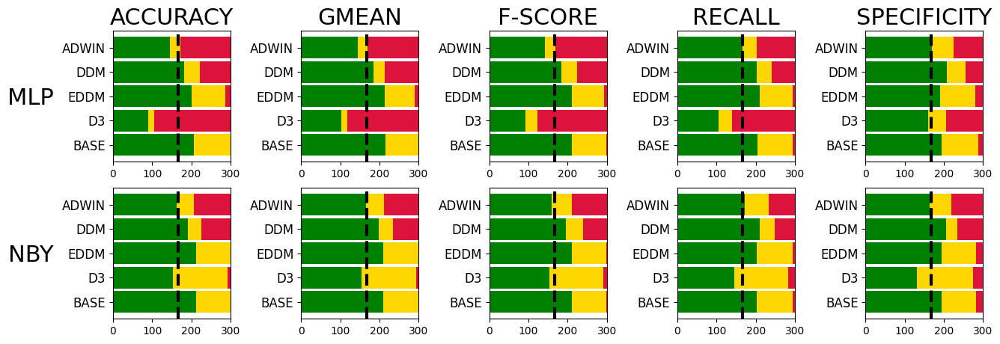
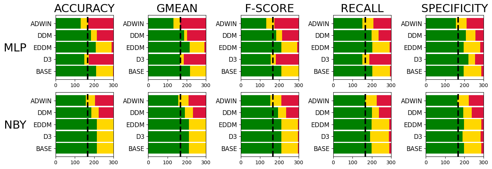
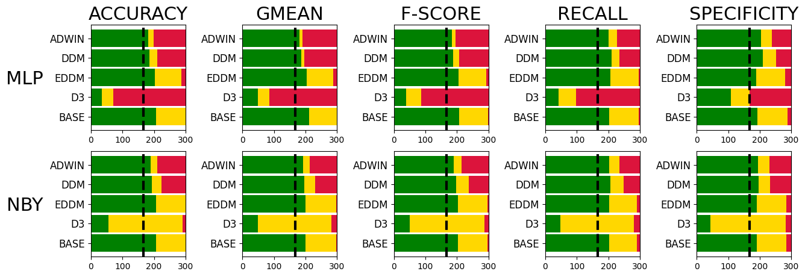
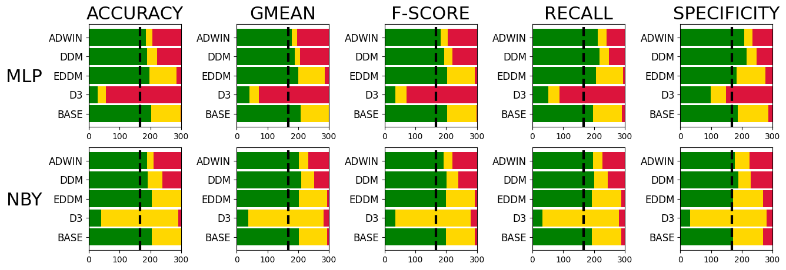
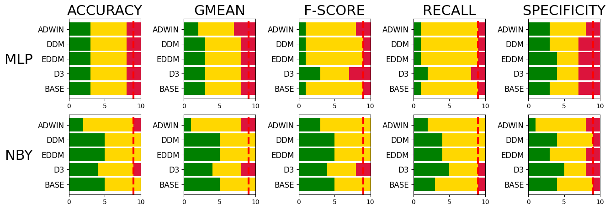

# Centroid Distance Drift Detector

### *Before use, prepare real data streams! (make prepare_data)*

This repository supplements the results and provides source code implementations prepared for the research article entitled "Concept drift detector based on centroid distance analysis". Most of the results are in raw form - confusion matrices and metrics scores. If one is interested in a much deeper analysis, use the `analyze_results_main.py` script to generate all the plots. Below is a set of the most relevant results.

## Supervised CDDD

*Synthetic data streams - gradual drift*

*Synthetic data streams - incremental drift*

*Synthetic data streams - sudden drift*

*Synthetic data streams - reccuring drift*

*Real data streams*

## Unsupervised CDDD

*Synthetic data streams - gradual drift*

*Synthetic data streams - incremental drift*

*Synthetic data streams - sudden drift*

*Synthetic data streams - reccuring drift*

*Synthetic data streams - reccuring drift*
